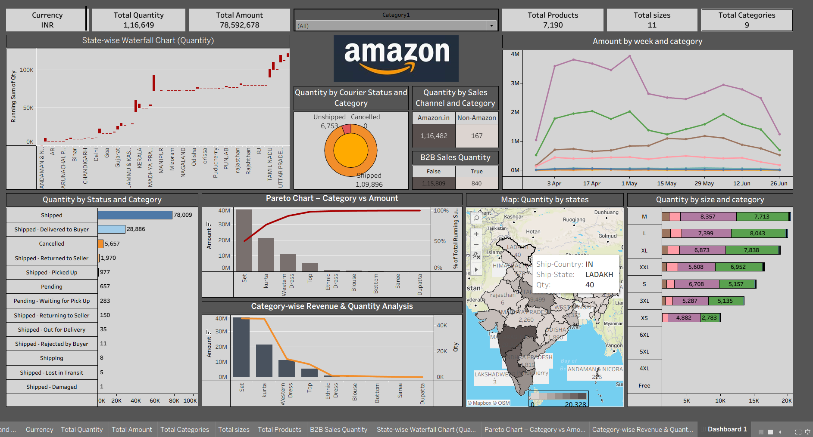
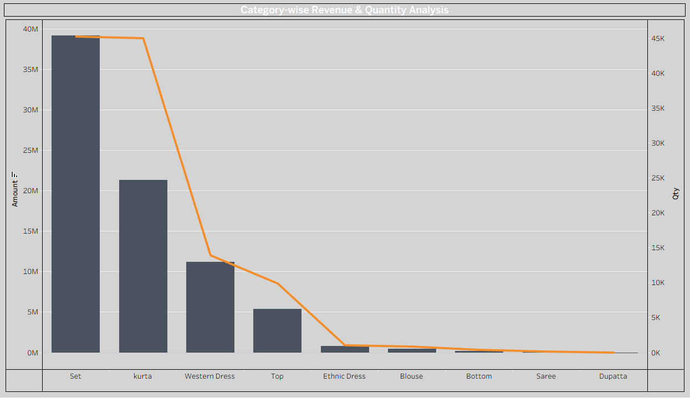
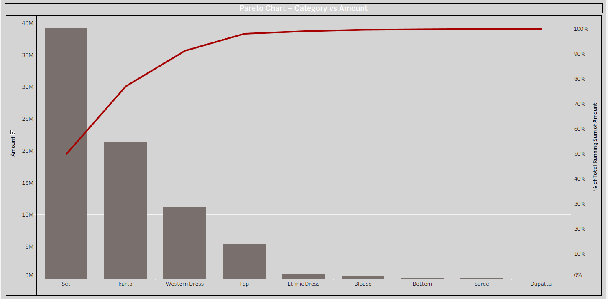
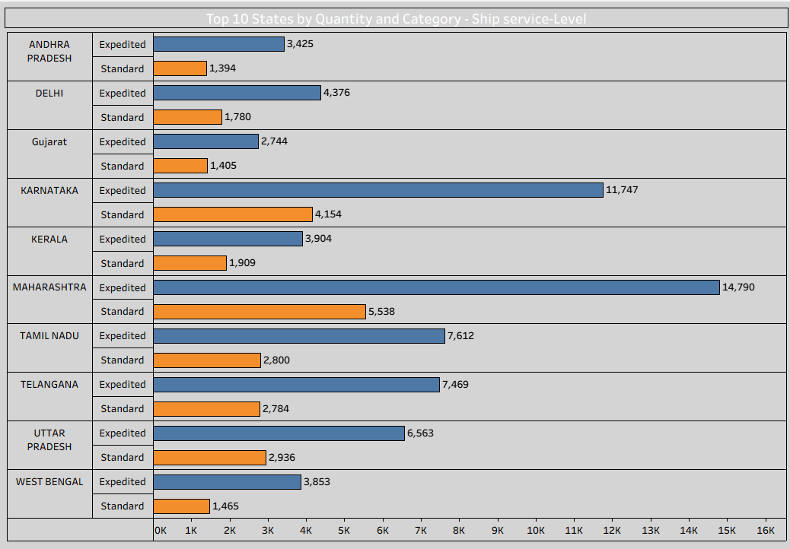

# 📊 Amazon Sales Analysis using Tableau

This project provides an in-depth analysis of Amazon sales data using Tableau. It highlights key insights related to product quantity, revenue trends, courier performance, weekly behavior, and state-wise contribution. Advanced visualizations like Pareto charts, waterfall charts, and maps help in business decision-making.

---

## 📁 Project Structure

```
Amazone/
│── Screenshot/
│ │── Amount by week and category.png
│ │── Category-wise Revenue & Quantity Analysis.png
│ │── Dashboard.png
│ │── Dataset Sample.png
│ │── Pareto Chart – Category vs Amount.png
│ │── State-wise Waterfall Chart (Quantity).png
│ │── Top 10 States by Quantity and Category - Ship service-Level.png
│
│── Amazon Sale Dashboard.twbx
│── Amazon Sale Report Card.pdf
│── README.md
```

---

# 🖼 **Screenshots (Preview)**

## 📌 **1. Overall Interactive Dashboard**


---

## 📌 **2. Dataset Sample**


---

## 📌 **3. Amount by Week and Category**


---

## 📌 **4. Category-wise Revenue & Quantity Analysis**


---

## 📌 **5. Pareto Chart – Category vs Amount**


---

## 📌 **6. State-wise Waterfall Chart (Quantity)**
.png)

---

## 📌 **7. Top 10 States by Quantity and Category**


---

# 📊 **Key Insights**

- Majority revenue comes from a few high-performing categories (Pareto analysis).  
- State-wise quantity contribution shows clear regional patterns.  
- Courier status and ship service-level directly affect delivery performance.  
- Weekly sales fluctuate based on product categories.  
- Waterfall chart shows cumulative quantity contribution across states.  

---

# 🛠 Tools Used

- Tableau Desktop  
- Excel/CSV Dataset  
- PDF Report (for documentation)  

---

# 📄 Project Files

- **Interactive Tableau Dashboard:** `Amazon Sale Dashboard.twbx`  
- **Full Report:** `Amazon Sale Report Card.pdf`  

---

# 🏁 Conclusion

This Tableau project gives a complete 360° analysis of Amazon sales trends, category performance, and operational insights.  
It supports business optimization, decision-making, and performance measurement through clear data visualization.

---

# ✉ Contact

**Aditya Yadav**  
